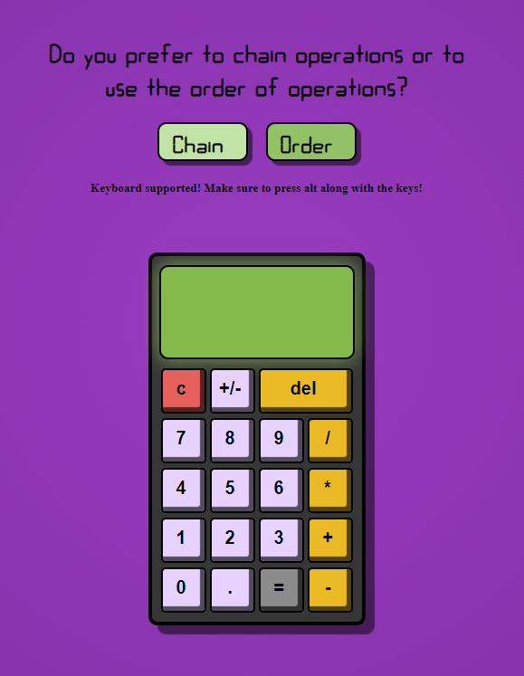

# Calculator Project 🧮

Welcome to my calculator project! This simple yet powerful calculator is built using HTML, CSS, and JavaScript. It's responsive, supports both chain operations and operations that follow the order of operations (PEMDAS), and even allows input via keyboard.

## Features ✨
- **Responsive Design**: Works seamlessly across various screen sizes.
- **Chain Operations**: Allows chaining multiple operations together.
- **Order of Operations**: Follows PEMDAS (Parentheses, Exponents, Multiplication and Division, Addition and Subtraction) for accurate calculations.
- **Keyboard Support**: Input calculations using your keyboard for increased efficiency.

## Live Preview 🌐
Check out the live preview of the calculator [here](https://blondymartinez.github.io/Calculator/).

## Demo 📺

## How to Run 🏃‍♂️
To run this calculator project locally:
1. Clone this repository to your local machine.
2. Open the `index.html` file in your preferred web browser.
3. Start crunching numbers!

## Credits 🙌
This calculator project is developed by Blondy Martínez Montero with inspiration from various online resources and tutorials as part of The Odin Project Foundations course.

## Feedback and Contributions 📝
Feel free to open an issue if you encounter any bugs or have suggestions for improvements. Pull requests are also welcome!
